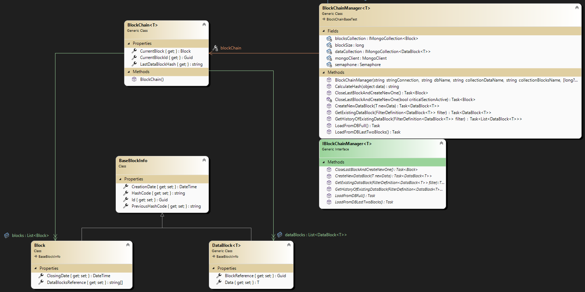

# blockChainSpike

The basis of this solution is the implementation of a blockChain in .NET which has the sole purpose of demonstrating how it works and the concepts behind it. The blockChain relies on a Mongo-type database.

## BlockChain concept

The diagram below shows a chain of Voucher type elements. Every n elements (customizable), a verification block is generated to increase the complexity of manipulating the chain. Each block generates a hashcode of the specific data that includes the hash of the previous block (this way you need to modify the hash of all the data following the element you want to alter). The same goes for the verification block, which is calculated on the hashes of the data that the block contains, and the hash of the previous block, so all the verification blocks that follow must also be modified.


The properties in yellow represent the information common to both the data and the blocks, since the behavior of the blocks and the data itself are very similar. The simplest way to represent such a data structure is through the class diagram below.



## Solution

The solution is divided into two projects, the first is the implementation of a generic blockchain manager, which can be typed with any type of element that can be serialized in json format. The manager is able to save to a MongoDB database in two different collections (one for the data set, the other for the verification blocks).
The second project is a specific implementation of a “voucher” blockchain, developed as a test project; therefore, it does not represent a project for verifying the functioning of the blockchain management classes, but rather it is more of a simulator of the intrinsic functioning of the blockchain.

To start the simulation, you need a MongoDB database which can be started and pre-configured through the scripts contained in the "scripts" folder.

To start a docker instance locally, start the following powershell script: ```./LaunchDockerContainer.ps1```